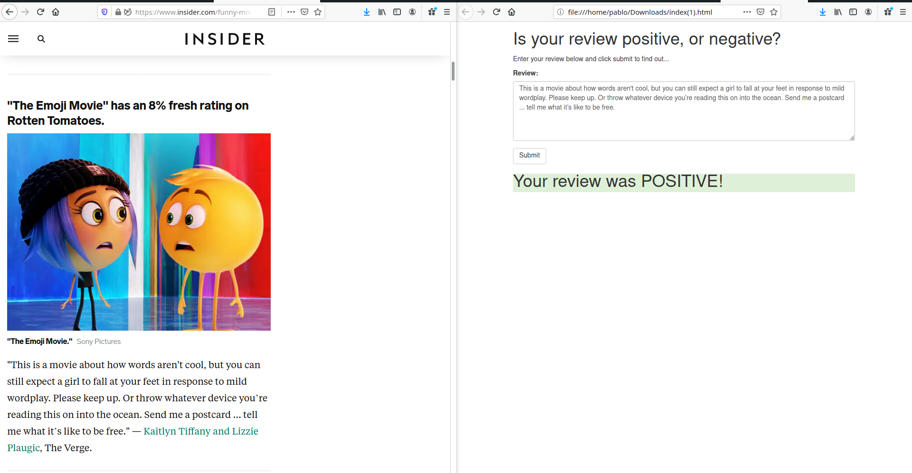

# Sentiment Analysis in AWS
First project in project Machine Learning Nanodegree Udacity. 

## About
This repository consists of a deployement of a neural network to classify movie reviews. The architecture of the NN is a LSTM module with 200 hidden units and 64 dimensional embeddings followed by a fully-connected layer and a sigmoid.

The training is performed over the [IMDb dataset](http://ai.stanford.edu/~amaas/data/sentiment/)

> Maas, Andrew L., et al. [Learning Word Vectors for Sentiment Analysis](http://ai.stanford.edu/~amaas/data/sentiment/). In _Proceedings of the 49th Annual Meeting of the Association for Computational Linguistics: Human Language Technologies_. Association for Computational Linguistics, 2011.

## For Review

- [SentimentAnalysis pdf](SentimentAnalysis.pdfy).
- [Web app (off)](website/index.html)

## Getting Started

You would need to clone this repository in a jupyter environment in SageMaker. Then open the jupyter notebook [SageMaker Project](SageMaker Project.ipynb) and follow it. Alternatively, you can have a look at a snapshot of the jupyter notebook in pdf: [SentimentAnalysis](SentimentAnalysis.pdfy).

When deployed, [this webpage](website/index.html) should be working properly if the correct endpoint and API gateway are set up. You would need to modify this url!

## Requirements
In principle if it is run in AWS, the requirements are included in the folder train:

- pandas
- numpy
- nltk
- beautifulsoup4
- html5lib
